# Text2Cuts DB 스키마 설계

## 📊 데이터베이스 구조도

```mermaid
graph TB
    subgraph "text2cuts_projects Collection"
        P[Project Document]
        P --> P1[project_id: unique ID]
        P --> P2[user_id: 사용자 ID]
        P --> P3[title: 프로젝트 제목]
        P --> P4[original_text: 원본 텍스트]
        P --> P5[characters: Array]
        P5 --> C1[name, description]
        P5 --> C2[visual_description]
        P5 --> C3[reference_prompt]
        P --> P6[storyboard: Object]
        P6 --> S1[scenes: Array]
        P6 --> S2[total_cuts: Number]
        P --> P7[cuts: Array 1-N]
        P7 --> CUT1[cut_number: 1-N]
        P7 --> CUT2[description, dialogue]
        P7 --> CUT3[image_prompt]
        P7 --> CUT4[image_url]
        P --> P8[settings: Object]
        P8 --> SET1[style_preset]
        P8 --> SET2[aspect_ratio]
        P8 --> SET3[quality, resolution]
        P --> P9[status: Status]
        P --> P10[timestamps]
    end
    
    subgraph "generation_analytics Collection"
        A[Analytics Document]
        A --> A1[project_id: Reference]
        A --> A2[Performance Metrics]
        A2 --> PERF1[generation_time]
        A2 --> PERF2[tokens_used]
        A --> A3[Quality Metrics]
        A3 --> Q1[consistency_score]
        A3 --> Q2[user_rating]
    end
    
    subgraph "user_history Collection"
        U[User History]
        U --> U1[user_id: unique]
        U --> U2[projects: Array]
        U --> U3[statistics]
        U3 --> STAT1[total_projects]
        U3 --> STAT2[total_cuts]
        U3 --> STAT3[credits_used]
    end
    
    P -.->|Reference| A1
    P -.->|User Reference| U1
    
    style P fill:#f9f,stroke:#333,stroke-width:4px
    style A fill:#bbf,stroke:#333,stroke-width:2px
    style U fill:#bfb,stroke:#333,stroke-width:2px
```



## 📁 컬렉션 구조

### 1. **text2cuts_projects** (메인 컬렉션)
텍스트를 웹툰으로 변환한 프로젝트 전체 데이터

#### 필드 구조:
```javascript
{
  "_id": ObjectId,
  "project_id": "unique_project_id",
  "user_id": "user_123",
  "title": "프로젝트 제목",
  "original_text": "원본 입력 텍스트...",
  
  // 캐릭터 정보
  "characters": [
    {
      "name": "주인공",
      "description": "성격 설명",
      "visual_description": "외모 설명",
      "reference_prompt": "이미지 생성 프롬프트"
    }
  ],
  
  // 스토리보드
  "storyboard": {
    "total_scenes": 5,
    "total_cuts": 20,
    "scenes": [
      {
        "scene_number": 1,
        "description": "씬 설명",
        "location": "장소",
        "characters_present": ["주인공", "조연"]
      }
    ]
  },
  
  // 개별 컷 데이터
  "cuts": [
    {
      "cut_number": 1,
      "cut_type": "establishing",
      "scene_number": 1,
      "description": "컷 설명",
      "dialogue": "대사",
      "image_prompt": "생성 프롬프트",
      "image_url": "/images/cut_1.jpg",
      "generation_time": 2.5
    }
  ],
  
  // 생성 설정
  "settings": {
    "style_preset": "manhwa",
    "aspect_ratio": "9:16",
    "quality": "high",
    "resolution": "1024x1536"
  },
  
  // 상태 관리
  "status": "completed",
  "progress": 100,
  "current_step": "completed",
  
  // 메타데이터
  "created_at": ISODate,
  "updated_at": ISODate,
  "completed_at": ISODate,
  "total_generation_time": 120.5
}
```

### 2. **generation_analytics** (분석 데이터)
생성 과정의 성능 및 품질 메트릭

```javascript
{
  "_id": ObjectId,
  "project_id": "project_reference",
  "text_analysis": {
    "text_length": 5000,
    "word_count": 800,
    "sentence_count": 50
  },
  "performance": {
    "text_analysis_time": 1.2,
    "storyboard_generation_time": 3.5,
    "image_generation_time": 95.3,
    "total_time": 100.0
  },
  "quality": {
    "consistency_score": 0.85,
    "style_adherence_score": 0.92,
    "user_rating": 4.5
  }
}
```

### 3. **user_history** (사용자 히스토리)
사용자별 생성 이력 및 통계

```javascript
{
  "_id": ObjectId,
  "user_id": "user_123",
  "projects": [
    {
      "project_id": "proj_1",
      "title": "프로젝트 1",
      "created_at": ISODate,
      "cuts_count": 20
    }
  ],
  "statistics": {
    "total_projects": 15,
    "total_cuts_generated": 300,
    "total_credits_used": 450.5,
    "favorite_styles": ["manhwa", "comic"]
  }
}
```

## 🔑 인덱스 설정

```javascript
// text2cuts_projects
db.text2cuts_projects.createIndex({ "project_id": 1 }, { unique: true })
db.text2cuts_projects.createIndex({ "user_id": 1 })
db.text2cuts_projects.createIndex({ "status": 1 })
db.text2cuts_projects.createIndex({ "created_at": -1 })

// generation_analytics
db.generation_analytics.createIndex({ "project_id": 1 })
db.generation_analytics.createIndex({ "timestamp": -1 })

// user_history
db.user_history.createIndex({ "user_id": 1 }, { unique: true })
```

## 💡 주요 특징

1. **프로젝트 중심 구조**: 각 텍스트→웹툰 변환이 하나의 프로젝트
2. **컷 단위 관리**: 개별 컷(패널)별 상세 정보 저장
3. **캐릭터 일관성**: 캐릭터 정보 별도 관리
4. **스토리보드**: 씬과 컷의 계층 구조
5. **생성 추적**: 각 단계별 시간, 상태 추적
6. **분석 데이터**: 품질 메트릭 및 성능 지표

## 🔄 데이터 플로우

1. **텍스트 입력** → text2cuts_projects 생성 (status: pending)
2. **텍스트 분석** → characters, storyboard 업데이트
3. **이미지 생성** → cuts 배열에 추가, progress 업데이트
4. **완료** → status: completed, analytics 생성
5. **사용자 히스토리** → user_history 업데이트

## 📊 사용 예시

```python
# 새 프로젝트 생성
project = {
    "project_id": generate_id(),
    "user_id": current_user.id,
    "title": "나의 첫 웹툰",
    "original_text": "옛날 옛적에...",
    "status": "pending",
    "settings": {
        "style_preset": "manhwa",
        "aspect_ratio": "9:16"
    }
}

# 컷 추가
cut = {
    "cut_number": 1,
    "description": "주인공 등장",
    "image_prompt": "young hero standing...",
    "image_url": generated_url
}
project["cuts"].append(cut)

# 진행률 업데이트
project["progress"] = (len(project["cuts"]) / total_cuts) * 100
```